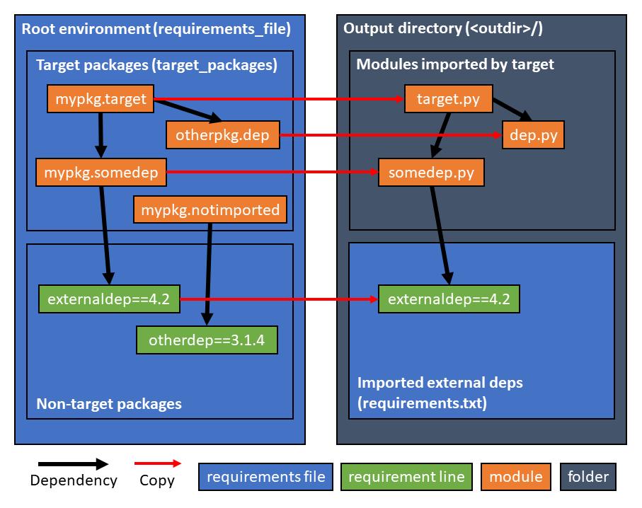

treeshaker
==========

A tree-shaking tool for Python.

What it does
------------

If you give treeshaker a root environment (specified by a `requirements.txt`
file), a list of target packages `target_packages` (in this case `mypkg` and
`otherpkg`), and a target module (in this case `mypkg.target`), treeshaker will
create an output directory that contains

 1. the subset of modules among all the modules in all the `target_packages`
    that are needed to import the target module, copied as .py files directly
    into the root of the output directory and
 2. a new `requirements.txt` file containing the subset of the root
    `requirements.txt` lines needed to import all the modules in (1)

An end user can then open the folder, `pip install -r requirements.txt`, and
import the target module, without installing or obtaining the complete code for
any of the `target_packages`.

Quick start
-----------

 1. Install treeshaker:

        $ pip install treeshaker

 2. Define your root environment in a `requirements.txt` file and ensure the
    listed packages are available in your current Python environment. If you
    don't have a `requirements.txt` file yet, you can run

        $ pip install <package that provides target module>
        $ pip freeze > requirements.txt
    
    If you already have a `requirements.txt` file, you can instead run

        $ pip install -r requirements.txt

 3. Create a configuration file (see the [example config file](examples/treeshaker.cfg)
    for reference), specifying the location of your root `requirements.txt` file
    as well as the details of what targets should be built and how.

 4. Run treeshaker:

        $ treeshaker

Demo
----

 1. `git clone https://github.com/sclabs/treeshaker.git`
 2. `cd treeshaker`
 3. `virtualenv venv`
 4. `source venv/bin/activate`
 5. `pip install . ./examples/mypkg ./examples/otherpkg ./examples/externaldep ./examples/otherdep`
 6. `treeshaker --config examples/treeshaker.cfg`

To clean up after the demo run

    $ python examples/clean.py

Important features
------------------

### Building multiple targets versus building one target

To build one specific target, run

    $ treeshaker --target <target_module_name>

treeshaker will find the configuration file section `[target:<target_module>]`
(which must exist) to determine the `outdir` (a required key in every
`[target:<target_module>]` section) and all other parameters for the build.

To build a list of targets, add the desired targets to the `[targets]` section
(as keys with no values) and run

    $ treeshaker

### Module renaming

The copied modules will be renamed if necessary to avoid name conflicts.

If one copied module is `mypkg.dep` and another is `otherpkg.dep`, these will be
renamed to `dep_mypkg.py` and `dep_otherpkg.py`, respectively.

### Import rewriting

During module renaming, treeshaker will attempt to rewrite import statements in
the copied modules as necessary. The logic for doing this is quite rudimentary
and is only expected to succeed when the import is of the form

    import mypkg.mymod

or

    from mypkg.mymod import not_a_module

In these cases, when `mypkg.mymod` is copied, it will be renamed and a simple
find-and-replace will "fix" the import statement.

The following form of import is expected to fail:

    from mypkg import mymod

Relative imports are generally also expected to fail, though they may work when
importing a sibling module whose name has no conflicts.

### Configuration file inheritance

If a key is missing from a `[target:<target_module>]` section, treeshaker will
fall back to looking for the key in the `[target]` section.

The [example configuration file](examples/treeshaker.cfg) defines many keys in
the `[target]` section, but all of these can be overridden on a per-target basis
by adding the key to the corresponding `[target:<target_module>]` section.

### `<outdir>` interpolation

You can use the special string `<outdir>` in the `[target]` section or any
`[target:<target_module>]` section and it will be replaced with the actual
outdir at runtime.

### Automatic documentation

Functions and/or classes listed in a `functions` key and [python-fire](https://github.com/google/python-fire)
components listed in a `fire_components` key in the configuration file will be
documented in `<outdir>/README.md`, using their docstring or fire help page,
respectively.

You can also manually write a README section that will be included in
`<outdir>/README.md` by specifying a filename in a `readme` key. If this file
does not exist on the disk, it will not be included.

### Custom configuration file name

To run treeshaker using a specific configuration file, run

    $ treeshaker --config path/to/customconfig.cfg

How does it work?
-----------------

### Dependency graph construction

Python provides [modulefinder](https://docs.python.org/2/library/modulefinder.html) in the
standard library, but it is not quite powerful of flexible enough to accomplish
what we want. Instead, we use the [modulegraph](https://github.com/ronaldoussoren/modulegraph)
library, which is both performant (thanks to the useful `excludes` argument) and
flexible (it creates a dependency graph that we can analyze in detail to
classify imported modules).

### Matching PyPI package names to root module names

How can treeshaker determine that if you import a module from `sklearn`, the
corresponding `requirements.txt` line is e.g., `scikit-learn==0.22.1`?

[pipreqs](https://github.com/bndr/pipreqs) has compiled a mapping of PyPI names
to root module names for many PyPI packages; we use this list to perform this
matching. We considered adding a dependency on pipreqs, but we decided to vendor
it ourselves to avoid an additional seven dependent package installs (we only
use the single file that contains the mapping).

For consistency, we choose to use the actual module name (the one used in
imports and the one that reflects the location of the package on-disk after
install) to specify the `target_packages`.

Caveats
-------

While treeshaking is a cool concept, there's rarely any real need to perform
treeshaking on Python code. This library was created for a highly specific use
case: automatically minimizing the amount of code revealed from a monolithic
private codebase when providing code for one specific module (or more
specifically, the task that module performs).

In a monolithic library design, it's possible to have a very large number of
modules and a large number of tasks that the library can accomplish. It might be
better to apply the "single responsibility principle" and design a set of
libraries that each do one task, but what happens when the monolith already
exists and a redesign is not feasible? In most situations, there is no harm in
distributing the entire library even if the person requesting the code wants to
accomplish just one task. However, when the library code is private, it may be
desirable to minimize the total amount of code "exposed" or "revealed" to the
requestor.
